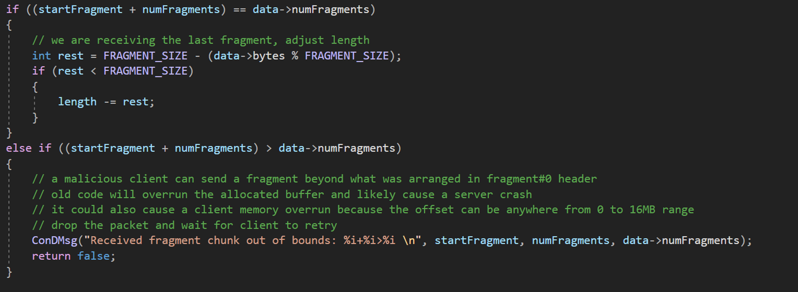
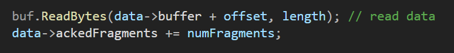
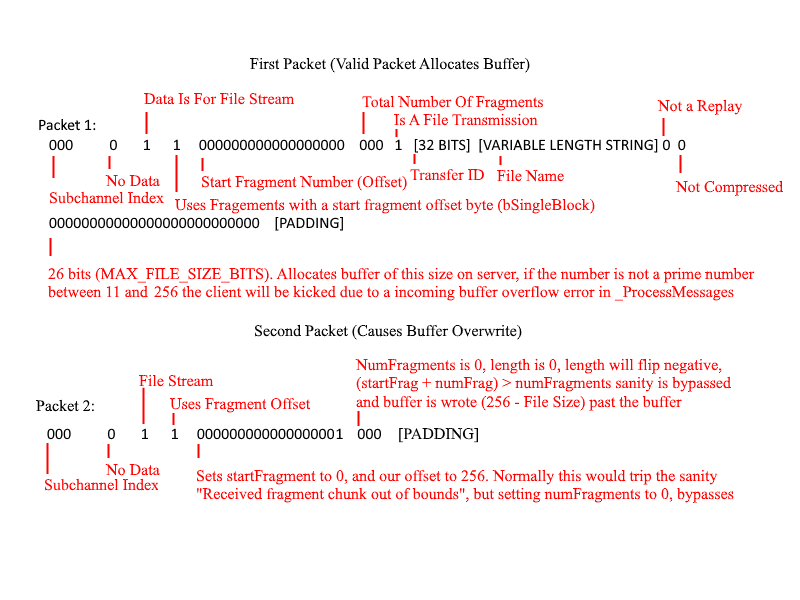

# PoC Code For Causing A CS:GO Dedicated Server To Crash

**Reported To Valve's HackerOne Program on October 29th 2021 under "#1386062, OOB Write due to Improper Checking of Buffer Bounds leads to Memory Corruption and Crash"**


***Valve responded to this bug on 05/23/2023 and quickly resolved/patched the bug***

## Technical Background 
The source engine builds a reliable message system on top of the standard UDP/steam-datagram networking sockets. "datafragements" are transmitted from the client to the server comprising a single reliable message, where the receiver proceeds to keep track of current messages, and ACK successful reception. Non-ACK'd messages are retransmitted by the client. 

When a server initially recieves a datafragment transmission, it will allocate a buffer for this fragment. When transmitting a data fragment, The transmitter will select a **startFragment** value, which indicates an offset in which the data being transmitted begins. Inital transmission of data will always have a **startFragment** of 0. Additionally, the client will transmit a **numFragments** value, which indicates the total number of fragments left within the current reliable message. The receiver will calculate its own **numFragments (r)** value based on the number of total bytes within the message as stated in the initial header, which describes the total number of fragments in the message.

As the transmitter sends messages, the **numFragments** value is decremented and the **startFragment** value is incremented. To prevent buffer overflows, the datafragment's **startFragment** value and the **numFragments** value are added, and compared to the receivers calculated **numFragments (r)** value, reception is aborted if the values over-run the maximum alloted fragments. The **startFragment** value is then multiplied by the defined fragment size to calculated the index within the buffer the data will be written, and the **numFragment** value is used to calculate how much data to write to the buffer.



## The Bug

When a buffer is allocated normally for the first packet, and a subsequent packet states that the number of fragments is 0, while setting **startFragment** to one above the maximum alloted fragments, the buffer will be overwritten causing memory corruption on the heap. 

Within the function [`ReadSubChannelData`](https://github.com/perilouswithadollarsign/cstrike15_src/blob/f82112a2388b841d72cb62ca48ab1846dfcc11c8/engine/net_chan.cpp#L1699), the following line is used to calculate whether a incoming buffer overflow is possible:

```C
if ((startFragment + numFragments) > data->numFragments)
```        

In the condition that a client initially stated a total number of fragments evaluating to 1, the data buffer will be allocated as:

```C
buffer = malloc(numFragments /* r calculated */ * 256 /* max fragment size*/ );`
```

For visualization, this can be seen as `char buffer[256]`.

A subsequent packet with a **numFragments** of 0 and a **startFragment** of 1 will pass the overflow sanity check, as `(1 + 0 > 0) == true`. 

The calculated buffer index will be evaluated as `startFragment * 256 /* Maximum Fragment Size*/`, placing the position to write data, at `&buffer[256]`.

To calculate the length of data to write, the calculation : `numFragments - (256 - total_bytes % 256)` is utilized. In the condition of **numFragments** being set to 0, this will evaluate as `0 - ( 256 - (256 % 256))  == -256`. The function which writes to the buffer will cast the value to an unsigned 32bit integer, causing the statement to evaluate to 4294967039



Upon reaching the statement to read data bytes to the buffer, the function invokation will evaluate to:

```C++
buf.ReadBytes(&buffer[sizeof(buffer)], 4294967039)
```

both overruning the reliable message buffer for writing, and overruning the fragment buffer for reading. This will cause heap corruption and the program will crash. 

Packet Breakdown:



## PoC Video:
 [](https://www.youtube.com/watch?v=lHU_zk2xwbA)


